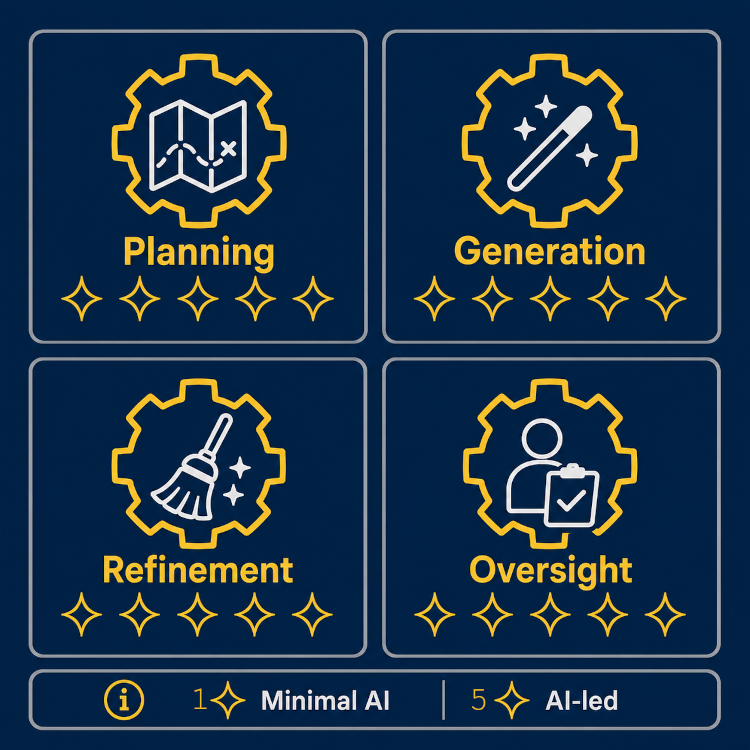

# AI Use Disclosure Framework



An open, reusable framework for disclosing artificial intelligence (AI) involvement in software, data science, research, and technical projects.

AI involvement is not simply present or absent. Spellcheck, brainstorming, generated functions, debugging assistance, and AI-led implementation are materially different forms of use. This framework makes those differences visible by rating AI involvement across four independent categories.

## How It Works

Each category is rated independently on a **0–5 scale**:

| Score | Level | Meaning |
|---:|---|---|
| **0** | No AI | No AI was used in this category. |
| **1** | Minimal | AI provided minor or isolated assistance. |
| **2** | Advisory | AI suggested options, examples, or localized improvements. |
| **3** | Collaborative | AI made meaningful contributions alongside substantial human input. |
| **4** | Extensive | AI produced or directed most of the work in this category. |
| **5** | AI-led | AI largely performed or determined the work in this category. |

The four categories are:

1. **Planning and Research**
2. **Content or Code Generation**
3. **Editing, Debugging, and Refinement**
4. **Verification and Quality Assurance**

The scores should **not** be averaged into a single overall rating. The purpose is to show *where* and *how* AI contributed.

## How to Use It

1. **Rate AI involvement.** Use the [Rating Guide](#rating-guide) to assign a 0–5 score to each category.
2. **Create your disclosure.** Copy the [Project Template](#project-template) into an `AI_DISCLOSURE.md` file and add a short project-specific description.
3. **Add the visual.** Optionally customize `AI_DISCLOSURE.png` by filling the appropriate number of sparkles for each category and include it with your disclosure. Zero filled sparkles represents **0/5: No AI**.

## Project Template

Copy the following into `AI_DISCLOSURE.md` in the root of your project repository:

```markdown
# AI Use Disclosure


This project uses the [AI Use Disclosure Framework](https://github.com/RayofData/AI_USE_DISCLOSURE) to report how AI contributed to the work.

## Rating Summary

| Category | Rating | Level |
|---|---:|---|
| Planning and Research | **__/5** | [No AI / Minimal / Advisory / Collaborative / Extensive / AI-led] |
| Content or Code Generation | **__/5** | [No AI / Minimal / Advisory / Collaborative / Extensive / AI-led] |
| Editing, Debugging, and Refinement | **__/5** | [No AI / Minimal / Advisory / Collaborative / Extensive / AI-led] |
| Verification and Quality Assurance | **__/5** | [No AI / Minimal / Advisory / Collaborative / Extensive / AI-led] |

**AI Scale:** 0/5 No AI · 1/5 Minimal · 2/5 Advisory · 3/5 Collaborative · 4/5 Extensive · 5/5 AI-led

## Project-Specific Disclosure

> AI was used for [specific tasks such as planning, research, code generation, debugging, documentation, testing, or editing].
>
> The author [describe how the work was reviewed, modified, tested, fact-checked, or independently verified].

---

For complete category definitions and scoring guidance, see the [AI Use Disclosure Rating Guide](https://github.com/RayofData/AI_USE_DISCLOSURE#rating-guide).
```

The project-specific disclosure should usually be **2–4 sentences**. Name the tasks AI actually assisted with and explain how the human author evaluated or verified the resulting work.

---

# Rating Guide

All four categories use the same direction:

- **0/5:** No AI involvement
- **5/5:** AI-led involvement

Higher scores always indicate greater AI involvement.

## 1. Planning and Research

Includes brainstorming, outlining, source discovery, research summaries, project architecture, data sourcing strategies, tool or library selection, experimental design, and workflow planning.

| Level | Label | Description |
|---:|---|---|
| **0** | No AI | No AI was used for planning or research. |
| **1** | Minimal | AI provided isolated definitions, search queries, or basic reference help. |
| **2** | Advisory | AI suggested ideas, sources, tools, libraries, datasets, or possible approaches. |
| **3** | Collaborative | AI helped shape major parts of the project outline, technical approach, research plan, or architecture. |
| **4** | Extensive | AI generated most of the research synthesis, architecture, experimental plan, or implementation strategy. |
| **5** | AI-led | AI largely determined the overall direction, technical approach, methodology, and execution plan. |

## 2. Content or Code Generation

Includes code, scripts, functions, queries, notebooks, visualizations, documentation, technical writing, tests, configuration files, and other project content.

| Level | Label | Description |
|---:|---|---|
| **0** | No AI | No AI-generated content or code was used. |
| **1** | Minimal | AI use was limited to spellcheck, autocomplete, syntax assistance, or isolated words and lines. |
| **2** | Advisory | AI generated small examples, boilerplate, utility snippets, or short passages incorporated into human-created work. |
| **3** | Collaborative | AI generated meaningful functions, transformations, analyses, or documentation that the human substantially revised or expanded. |
| **4** | Extensive | AI produced most of the initial code, notebook cells, documentation, or written content, followed by human refinement. |
| **5** | AI-led | The large majority of the final code, analysis, documentation, or written material was directly produced by AI. |

## 3. Editing, Debugging, and Refinement

Includes grammar correction, rewriting, restructuring, debugging, refactoring, error handling, optimization, code modularization, formatting, and presentation improvements.

| Level | Label | Description |
|---:|---|---|
| **0** | No AI | No AI was used for editing, debugging, or refinement. |
| **1** | Minimal | AI provided minor formatting help, basic error explanations, or isolated corrections. |
| **2** | Advisory | AI identified localized issues, suggested specific fixes, or improved individual sections or functions. |
| **3** | Collaborative | AI debugged, rewrote, optimized, or refactored multiple meaningful parts of the project. |
| **4** | Extensive | AI performed substantial restructuring, debugging, optimization, or refinement across most of the work. |
| **5** | AI-led | AI directed the refinement process and produced most of the final revisions, fixes, or optimizations. |

## 4. Verification and Quality Assurance

Measures how much AI was relied upon to verify facts, audit code, validate data integrity, test outputs, check logic, or assess final quality.

**A higher score still means greater AI involvement.** This category measures reliance on AI for verification, not the amount of human diligence. **0/5 means verification was performed independently without AI assistance, while 5/5 means verification was largely AI-led.**

| Level | Label | Description |
|---:|---|---|
| **0** | No AI | Verification and quality assurance were performed independently without AI assistance. |
| **1** | Minimal | The human independently reviewed, tested, and verified all important work, with only minor AI assistance. |
| **2** | Advisory | AI suggested checks, edge cases, assertions, or test scenarios, but the human performed and evaluated the verification independently. |
| **3** | Collaborative | AI generated or performed meaningful checks or tests, while the human independently verified major claims, logic, data, and outputs. |
| **4** | Extensive | AI performed most testing, validation, or fact-checking, with limited independent human verification. |
| **5** | AI-led | The final work was accepted primarily through AI-generated checks or AI review, with minimal independent testing, source verification, or demonstrated human understanding. |

## Using This Framework

This framework is intended to be freely reusable and adaptable. Projects that use it should link to this repository when referencing the rating definitions so readers can review the complete framework.

The framework is designed to provide context, not to judge whether AI use is inherently good or bad. Its purpose is to make the nature and extent of AI involvement easier to understand.
